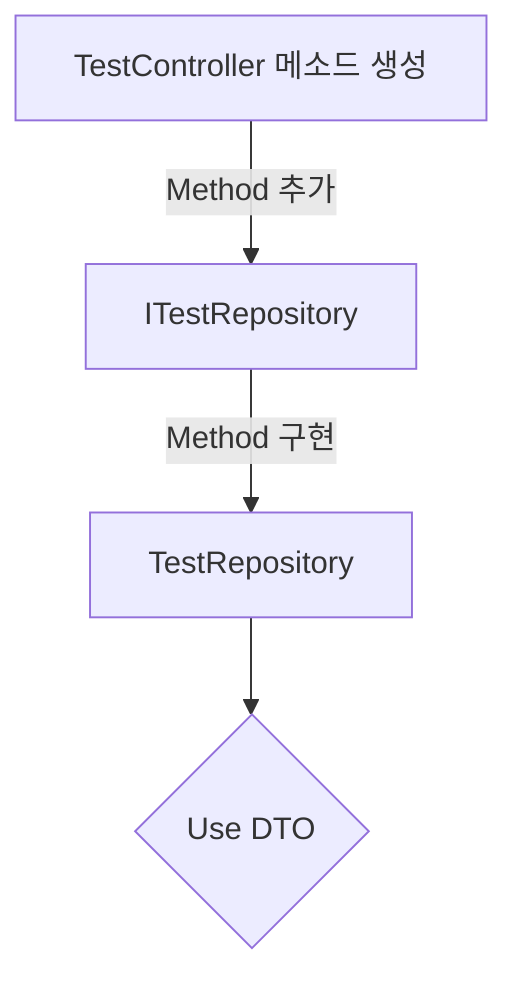

# ASP.NET Core Web API 8 2024 / 30회 / Teddy Smith

[동영상 강의](https://www.youtube.com/playlist?list=PL82C6-O4XrHfrGOCPmKmwTO7M0avXyQKc)

[.NET 코어 웹 API의 기존 "N-Layer" 아키텍처](https://www.linkedin.com/pulse/traditional-n-layer-architecture-net-core-web-api-tiromika-yasasvi/)


## [ASP.NET Core에 대한 .NET 핫 다시 로드 지원](https://learn.microsoft.com/ko-kr/aspnet/core/test/hot-reload?view=aspnetcore-8.0)

```bash
# 자동으로 Swagger 열림
dotnet watch run
```

## [Visual Studio 2022에서 .http 파일 사용](https://learn.microsoft.com/ko-kr/aspnet/core/test/http-files?view=aspnetcore-8.0#create-an-http-file)

`.http` 파일을 사용하여 API를 테스트하는 방법은 사용하는 개발 도구에 따라 다를 수 있습니다. 여기서는 Visual Studio와 Visual Studio Code에서 `.http` 파일을 사용하는 방법을 설명하겠습니다.

### Visual Studio에서 `.http` 파일 테스트

Visual Studio 자체에는 `.http` 파일을 직접 실행하는 기능이 없지만, 외부 도구를 사용하거나 Visual Studio의 다른 기능을 활용하여 API를 테스트할 수 있습니다.

1. **HTTP 파일 작성**:
   - Visual Studio 솔루션 탐색기에서 새 `.http` 파일을 생성하고, HTTP 요청을 작성합니다.

2. **Postman이나 다른 API 클라이언트 사용**:
   - Postman, Insomnia와 같은 API 테스트 도구를 사용하여 `.http` 파일에 작성된 요청을 복사하여 실행할 수 있습니다.

### Visual Studio Code에서 `.http` 파일 테스트

Visual Studio Code에서는 REST Client 확장을 사용하여 `.http` 파일을 테스트할 수 있습니다. REST Client 확장은 `.http` 파일에서 직접 HTTP 요청을 실행할 수 있게 해줍니다.

1. **REST Client 확장 설치**:
   - Visual Studio Code에서 확장 아이콘을 클릭하고 "REST Client"를 검색하여 설치합니다.

2. **`.http` 파일 생성 및 작성**:
   - Visual Studio Code에서 새 파일을 생성하고 확장자를 `.http`로 지정합니다.
   - 파일에 HTTP 요청을 작성합니다. 예:

     ```http
     ### Get all items
     GET https://localhost:5001/api/items

     ### Get item by ID
     GET https://localhost:5001/api/items/1

     ### Create a new item
     POST https://localhost:5001/api/items
     Content-Type: application/json

     {
       "name": "NewItem",
       "description": "This is a new item"
     }

     ### Update an item
     PUT https://localhost:5001/api/items/1
     Content-Type: application/json

     {
       "name": "UpdatedItem",
       "description": "This item has been updated"
     }

     ### Delete an item
     DELETE https://localhost:5001/api/items/1
     ```

3. **HTTP 요청 실행**:
   - 요청 줄 위에 있는 "Send Request" 링크를 클릭하면 해당 요청이 실행됩니다.
   - 응답은 Visual Studio Code 내의 새로운 탭에 표시됩니다.
   - 

이와 같이 REST Client 확장을 사용하면 `.http` 파일에서 작성한 HTTP 요청을 간편하게 실행하고, 응답을 바로 확인할 수 있습니다.

### cURL을 사용하여 테스트

`.http` 파일에 작성된 요청을 터미널이나 명령 프롬프트에서 cURL을 사용하여 테스트할 수도 있습니다. 예를 들어, `.http` 파일에 다음과 같은 요청이 있다면:

```http
GET https://localhost:5001/api/items
```

이를 cURL 명령으로 실행할 수 있습니다:

```sh
curl -X GET https://localhost:5001/api/items
```

POST 요청의 경우:

```http
POST https://localhost:5001/api/items
Content-Type: application/json

{
  "name": "NewItem",
  "description": "This is a new item"
}
```

이를 cURL 명령으로 실행할 수 있습니다:

```sh
curl -X POST https://localhost:5001/api/items -H "Content-Type: application/json" -d '{"name":"NewItem","description":"This is a new item"}'
```

이 방법을 사용하면 명령 줄에서 직접 API를 테스트할 수 있습니다.

## CRUD 코드 생성

1. Controller 에 메소드 작성
2. Controller에서 사용할 Repository 메소드 생성하기
    Repository Interface 에 메소드 추가
    Repository Interface 메소드 구현
       메소드에 Dto가 필요하다면


